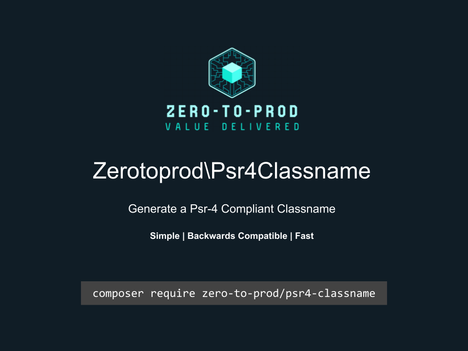

# Zerotoprod\Psr4Classname



[](https://github.com/zero-to-prod/psr4-classname)
[](https://github.com/zero-to-prod/psr4-classname/actions)
[](https://packagist.org/packages/zero-to-prod/psr4-classname/stats)
[](https://packagist.org/packages/zero-to-prod/psr4-classname/stats)
[](https://packagist.org/packages/zero-to-prod/psr4-classname)
[](https://github.com/zero-to-prod/psr4-classname/blob/main/LICENSE.md)

A regular expression to check an Email string.

## Installation

Install the package via Composer:

```bash
composer require zero-to-prod/psr4-classname
```

## Usage

```php
use Zerotoprod\Psr4Classname\Classname;

Classname::generate('weird%characters*in^name', '.php'); // 'WeirdCharactersInName.php';
```
